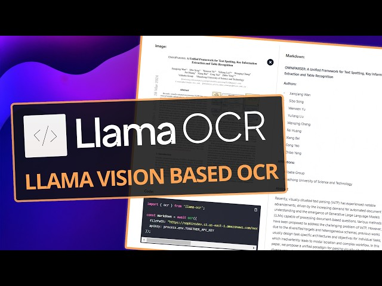

# 🧠 Build a No-Code OCR App Using OCI Generative AI and Streamlit



## 👋 Introduction
If you're a developer, cloud architect, or AI enthusiast who liked [llama OCR](https://github.com/Nutlope/llama-ocr), this post is for you.
In this tutorial, you'll build a simple, **llama OCR** (Optical Character Recognition)** web app that:
* Uses **OCI Generative AI’s Vision LLMs for meta**
* Extracts structured text from images (like receipts, scanned forms)
* Runs locally on your machine with **Streamlit**
* Doesn’t require any front-end coding

## 🎯 Who Is This For?
This app is ideal for:
* Oracle Cloud (OCI) users exploring **GenAI Vision models**
* Developers who want to prototype **document AI** tools
* Data teams that frequently handle scanned invoices, receipts, or forms
* Anyone looking to integrate **LLM + OCR** in a no-code UI

## ⚙️ What You'll Build
A web UI that allows you to:
- Upload an image (receipt, invoice, screenshot) in the application.
- Get the extracted **Markdown** output from the image using LLM
- View and copy the structured text

## 🏛️ Why OCI Gen AI service?
While there are many cloud providers offering Generative AI services, here’s why **Oracle Cloud Infrastructure (OCI)** stands out for this project:
### 🔒 Enterprise-Grade Security
Oracle offers built-in **data residency, encryption, and compartment isolation**, making it ideal for industries handling sensitive scanned documents like finance, healthcare, or government.
### 💰 Cost-Effective GenAI
OCI’s **flexible pricing** and **pay-as-you-go** options for Generative AI inference make it more affordable than comparable solutions on other hyperscalers.
### ⚙️ Native LLM Support
OCI hosts **open-source LLMs** like **Meta LLaMA 3**, **Mistral**, and **Command R** directly in your region. This means **lower latency** and no external API keys or SaaS contracts needed.
### 🧱 Full Stack Integration
From **Object Storage** to **Data Science**, **Monitoring**, and **Vault**, everything plugs in natively. You can integrate OCR output with downstream analytics, automation, or data pipelines with ease.
### 🔧 Developer Friendly
* One config file (~/.oci/config)
* No API gateway hoops
* Full Python SDK and CLI support
* IAM-based access control
If you’re already on OCI, this setup takes you from raw image to structured text in minutes.

## 🛠 Prerequisites
* ✅ [OCI CLI configured](https://docs.oracle.com/en-us/iaas/Content/API/SDKDocs/cliinstall.htm) (~/.oci/config)
* ✅ Access to **OCI Generative AI Service** in of the regions mentioned below
* ✅ A Vision-capable model deployed (like meta.llama-3.2-90b-vision-instruct)
* ✅ Python 3.8+
* ✅ Install required Python packages

## Regions with Generative AI
| Region Name | Location | Region Identifier | Region Key |
|---|---|---|---|
| Brazil East (Sao Paulo) | Sao Paulo | sa-saopaulo-1 | GRU |
| Germany Central (Frankfurt) | Frankfurt | eu-frankfurt-1 | FRA |
| Japan Central (Osaka) | Osaka | ap-osaka-1 | KIX |
| UAE East (Dubai) | Dubai | me-dubai-1 | DXB |
| UK South (London) | London | uk-london-1 | LHR |
| US Midwest (Chicago) | Chicago | us-chicago-1 | ORD |
## 💻 Setting Up a Virtual Environment (Windows & macOS/Linux)
Creating a virtual environment helps isolate dependencies and ensures your Streamlit OCR app doesn’t interfere with other Python projects on your system.
### For Windows:
#### Open **Command Prompt (cmd)** or **PowerShell**:


```python
#Navigate to your project folder
cd path\\to\\your\\project

#Create a virtual environment
python -m venv venv

#Activate the virtual environment
venv\\Scripts\\activate

#Install dependencies
pip install streamlit oci

```


### For macOS/Linux:
Open **Terminal**:
```python
#Navigate to your project directory
cd ~/path/to/your/project

#Create a virtual environment
python3 -m venv venv

# Activate the virtual environment
source venv/bin/activate

# Install dependencies
pip install streamlit oci
```

Once you're done, launch the app with:

```python
streamlit run llama-ocr-oci.py
```


Find the full code in the github : [mukundmurali-mm/llama-ocr-oci: Use llama OCR for extracting texts using OCI Gen AI services](https://github.com/mukundmurali-mm/llama-ocr-oci.git)
